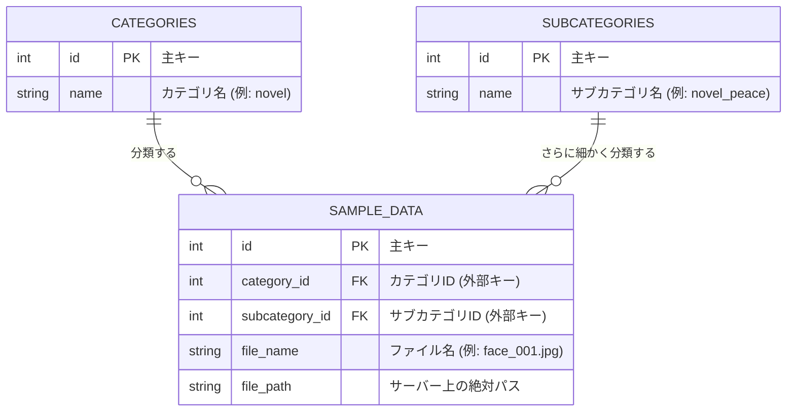

```mermaid
erDiagram
    CATEGORIES ||--o{ SAMPLE_DATA : "分類する"
    SUBCATEGORIES ||--o{ SAMPLE_DATA : "さらに細かく分類する"

    CATEGORIES {
        int id PK "主キー"
        string name "カテゴリ名 (例: novel)"
    }

    SUBCATEGORIES {
        int id PK "主キー"
        string name "サブカテゴリ名 (例: novel_peace)"
    }

    SAMPLE_DATA {
        int id PK "主キー"
        int category_id FK "カテゴリID (外部キー)"
        int subcategory_id FK "サブカテゴリID (外部キー)"
        string file_name "ファイル名 (例: face_001.jpg)"
        string file_path "サーバー上の絶対パス"
    }
```