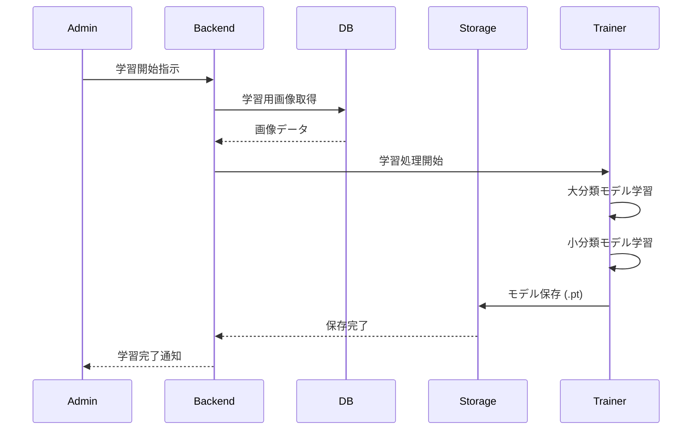

```mermaid
sequenceDiagram
    participant Admin
    participant Backend
    participant DB
    participant Storage
    participant Trainer

    Admin->>Backend: 学習開始指示

    Backend->>DB: 学習用画像取得
    DB-->>Backend: 画像データ

    Backend->>Trainer: 学習処理開始

    Trainer->>Trainer: 大分類モデル学習
    Trainer->>Trainer: 小分類モデル学習

    Trainer->>Storage: モデル保存 (.pt)
    Storage-->>Backend: 保存完了

    Backend-->>Admin: 学習完了通知
```