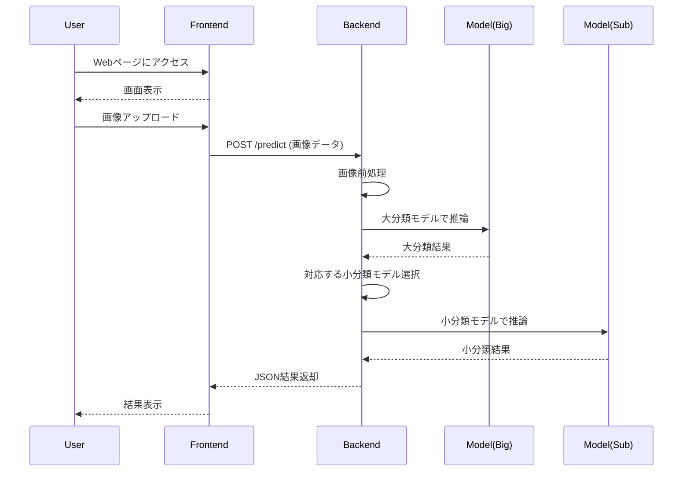

```mermaid
sequenceDiagram
    participant User
    participant Frontend
    participant Backend
    participant Model(Big)
    participant Model(Sub)

    User->>Frontend: Webページにアクセス
    Frontend-->>User: 画面表示

    User->>Frontend: 画像アップロード
    Frontend->>Backend: POST /predict (画像データ)

    Backend->>Backend: 画像前処理

    Backend->>Model(Big): 大分類モデルで推論
    Model(Big)-->>Backend: 大分類結果

    Backend->>Backend: 対応する小分類モデル選択

    Backend->>Model(Sub): 小分類モデルで推論
    Model(Sub)-->>Backend: 小分類結果

    Backend-->>Frontend: JSON結果返却
    Frontend-->>User: 結果表示
```