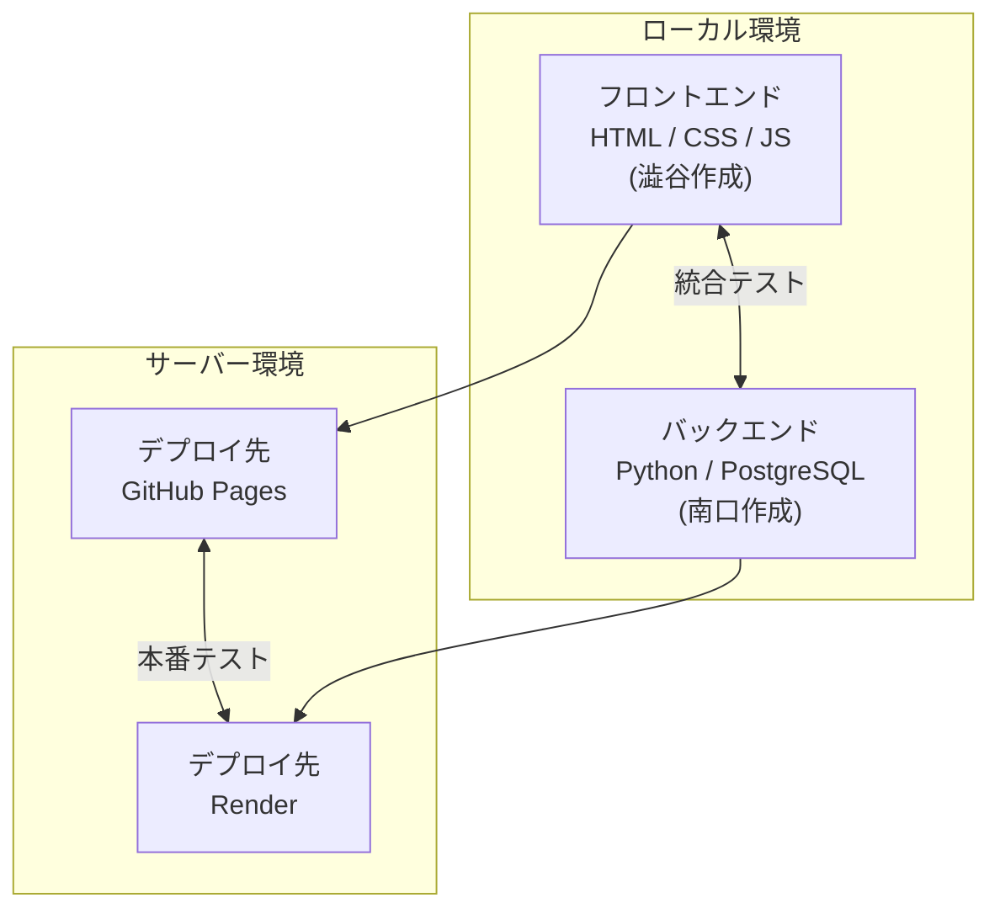
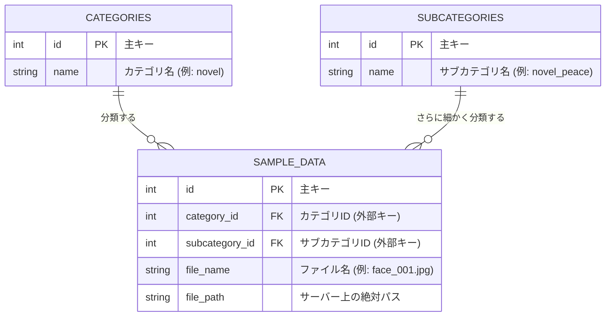

# 設計書（システム構成・ER図・画面構成案）

- 元ファイル: `ビジネスAIシステム開発_顔面偉業診断_仕様書ver2.docx / .pdf`, `仕様書_図.pptx`
- 機能要件・API仕様は [spec.md](./spec.md)、スケジュールは [plan.md](./plan.md) を参照

> ⚠️ このドキュメントは企画・計画段階（2026年4月）に作成された設計案をMarkdown化したものです。実際にリリースされた構成とは異なる部分があります。最終的な実装との差分は [README「11. 現状の制約・今後の展望」](../README.md#11-現状の制約今後の展望) を参照してください。

---

## 1. システム構成図（企画時点）

> 実装時の注記: 最終的にフロントエンドは **Vercel**、バックエンドは **Hugging Face Spaces（Docker）** にデプロイ先を変更しています。現在の構成は [README「4. システム構成」](../README.md#4-システム構成) を参照してください。

### 技術スタック（企画時点）

**フロントエンド**
- 言語: HTML / CSS / JavaScript
- フレームワーク / UIライブラリ: 澁谷の任意で選択

**バックエンド**
- 言語: Python + PyTorch
- フレームワーク: FastAPI
- APIの内容: 画像のバイナリデータを受け取り、それに対して偉業をstr型で返すAPI

**データベース**
- DBの種類: PostgreSQL（ER図は下記参照）

**インフラ（企画時点）**
- フロント: GitHub Pages
- バックエンド: 大学サーバー
- 画像保存: 大学サーバー内に作成するDB

---

## 2. ER図（学習データ管理用・企画時点）

（[backend/ER.md](../backend/ER.md) と同内容）

> 実装時の注記: 本番環境ではPostgreSQLは接続されておらず、学習データはサーバー上のディレクトリ構成（カテゴリ名フォルダ）でそのまま管理しています。

---

## 3. 画面構成案（変更OK・ワイヤーフレーム）

企画段階で作成した画面構成案です。実際のUIデザインは澁谷が最終決定し、現在の見た目は [README のスクリーンショット](../README.md) を参照してください。

### 3-1. 画像アップロード画面
- ヘッダー: 「顔面偉業診断ツール」
- 画像アップロード用の点線枠（プレースホルダー: 「ここに画像をアップロードしてね」）
- 「診断する」ボタン

### 3-2. 待機画面
- アップロード枠内に「顔画像を診断しています…。」の文言とプログレスバーを表示
- 「診断する」ボタンは非活性表示

### 3-3. 結果表示画面
- アップロードされた顔写真を画面上部に表示
- 「この顔の人は［大分類の予測結果］っぽいかも」
- 「細かく言うと［小分類の予測結果］っぽいかも」
- 「戻る」ボタン

> 実装時の注記: 小分類は未実装のため、現在の結果画面では大分類と確信度（%）のみを表示しています。

---

## 4. チーム間連携ツール

- バージョン管理ツール: Git + GitHub
- 仮想環境構築: Docker
